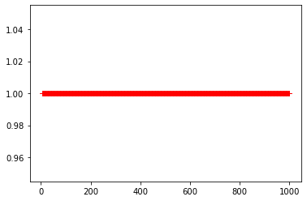
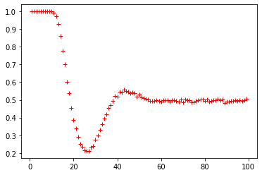
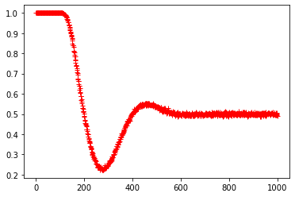
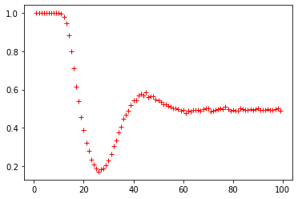
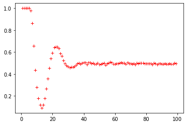
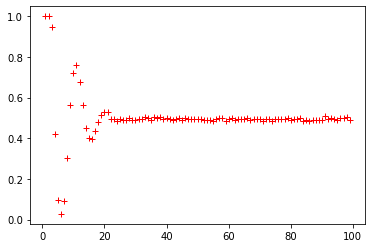
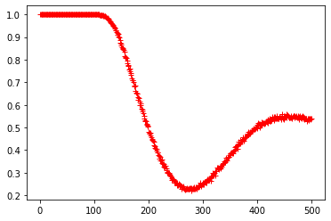
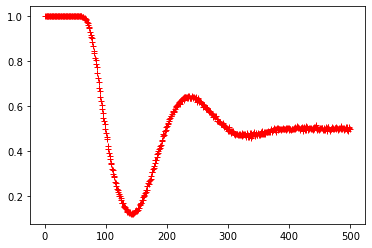
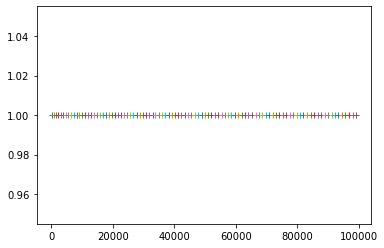
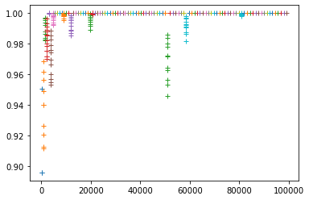

# Understanding the parameters of Learning With Errors (LWE)

In this notebook I will briefly explain the Learning with Errors (LWE) method, which is a post-quantum public-key cryptography algorithm. We provide the mathematical background then detail our implementation based on Python 3 and `numpy`, and finally our experiments, whose objective is to understand how changing the parameters of the algorithm affects the expected result. Our experiments are based on the encryption and decryption of a single bit message of value `1`, which are executed ten thousand times for each configuration tested. Graphs are created to visualise the results.

**Try live [here](https://mybinder.org/v2/gh/fredericoschardong/learning-with-errors-parameters/HEAD?filepath=Index.ipynb)**

## LWE Description

LWE is a post-quantum publick-key algorithm, see [this presentation](https://summerschool-croatia.cs.ru.nl/2018/slides/Introduction%20to%20post-quantum%20cryptography%20and%20learning%20with%20errors.pdf) for more information and [the original paper](http://citeseerx.ist.psu.edu/viewdoc/download?doi=10.1.1.205.2622&rep=rep1&type=pdf). This method can be resumed to the computations described in this section. First, to create a public and private key:


 and  are the public key,  is the private key and  is the random error, and . The matrixes  have dimension , that is, they are single column, because in this report we implement a single-bit encryption and decryption.

To encrypt a single-bit message  using the public key  we obtain the encrypted message composed of  with:


Where  are randomly chosen samples from  and . Finally, to decrypt the message  and find the value of bit message :


## LWE Implementation

The following `run` function was based on [this material](https://medium.com/asecuritysite-when-bob-met-alice/learning-with-errors-and-ring-learning-with-errors-23516a502406), where LWE is implemented to encrypt and decrypt a single bit of value `1`. All parameters required by the algorithm are passed as parameters for this function. They are:
+ `n` and `m`, where `n` is the number of rows of the single column matrixes , and `m` is the modulo for all the operations
+ `err` sets the largest value of the interval ![[1,err] \in \mathbb{Z}](https://render.githubusercontent.com/render/math?math=%5Cdisplaystyle+%5B1%2Cerr%5D+%5Cin+%5Cmathbb%7BZ%7D), from which error values are randomly drawn and then added to the result of , as described above
+ `sample` sets the number of samples drawn from the public key  to encrypt the bit-message `1`
+ `times` sets how many times the experiment is reproduced to find a statistically relevant result

The returned value is in the range ![[0,1] \in \mathbb{R}](https://render.githubusercontent.com/render/math?math=%5Cdisplaystyle+%5B0%2C1%5D+%5Cin+%5Cmathbb%7BR%7D) and represents how many experiments ran successfully, that is, correctly encrypted and decrypted the bit `1`.


```python
import matplotlib.pyplot as plt
import numpy as np

def run(n = 20, m = 97, err = 4, sample = 5, times = 10000):
    if sample > n: # or m > n:
        return None

    s = np.reshape(np.repeat(n, times), (times, 1))

    A = np.reshape(np.random.choice(range(m), n * times), (times, n))
    e = np.reshape(np.random.randint(1, err + 1, n * times), (times, n))
    B = (A * s + e) % m

    sample = np.reshape(np.random.choice(range(n - 1), sample * times), (times, sample))

    message = 1

    # this [np.arange(times)[:,None], sample] is used for indexing the 2d array
    u = np.sum(A[np.arange(times)[:,None], sample], axis = 1) % m
    v = (np.sum(B[np.arange(times)[:,None], sample], axis = 1) + (m // 2) * message) % m

    s = np.reshape(s, (1, times))

    return np.sum(((v - s * u) % m) > m / 2) / times
```

## Experiments

Having detailed the mathematical background and how our implementation of LWE works, we now proceed to perform some experiments and discuss their results.

### 1.  Exploring how `n` affects the result


```python
r = list(range(1000))
plt.plot(r, [run(n = i) for i in r], 'r+')
plt.show()
```





Increasing `n` doesn't affect the correctness of the encryption and decryption processes.

### 2. Exploring how `err` affects the result


```python
r = list(range(1, 100))
plt.plot(r, [run(err = i) for i in r], 'r+')
plt.show()
```





Apparently running LWE with the error range uper bound greater than roughly 10% of the modulo `m` affects the correctness of the output. Next, we try a prime modulo of about 10x the current to verify if the 10% threshold holds.


```python
r = list(range(1, 1000))
plt.plot(r, [run(m = 997, err = i) for i in r], 'r+')
plt.show()
```





That finding is apparently true. Next, let's explore if changing `n` will have any effect. Until now, the experiments ran using `n = 20`


```python
r = list(range(1, 100))

plt.plot(r, [run(n=50, err = i) for i in r], 'r+')
plt.show()

plt.plot(r, [run(n=90, err = i) for i in r], 'r+')
plt.show()
```





Same behaviour. Now let's change the sampling size.


```python
r = list(range(1, 100))

plt.plot(r, [run(sample=10, err = i) for i in r], 'r+')
plt.show()

plt.plot(r, [run(sample=20, err = i) for i in r], 'r+')
plt.show()
```








Increasing the sample size has an impact! Apparently..
Next, we try with modulo `m = 997` and double the sample on each test to see if the behaviour continues.


```python
r = list(range(1, 500))

plt.plot(r, [run(sample=5, m = 997, err = i) for i in r], 'r+')
plt.show()

plt.plot(r, [run(sample=10, m = 997, err = i) for i in r], 'r+')
plt.show()
```








Empircally testing LWE the parameters seem to have to respect the ratio of  to correctly encrypt and decrypt. 

Let's put this claim to the test. First we calculate all the prime numbers in the range ![[101,100000]](https://render.githubusercontent.com/render/math?math=%5Cdisplaystyle+%5B101%2C100000%5D) and select 1 for every 100 primes in the list. Then, for all these primes we select the number of samples at random (limiting at 1% of each prime) and calculate the uper bound value for the error range following the formula . Next, we run the LWE algorithm with the aforementioned parameters and plot the result. If our empirically found relation holds, then we shall see no point off the `1.0` value in the y axis.


```python
import random

def primes(n):
    """ Returns  a list of primes < n """
    """ https://stackoverflow.com/questions/2068372/fastest-way-to-list-all-primes-below-n/3035188#3035188 """
    sieve = [True] * n
    for i in range(3,int(n**0.5)+1,2):
        if sieve[i]:
            sieve[i*i::2*i]=[False]*((n-i*i-1)//(2*i)+1)
    return [2] + [i for i in range(3,n,2) if sieve[i]]

#primes from 101 to 99991 from 100 to 100
list_of_primes_to_100K = primes(100000)[25:-1:100]

#store our randomly selected sample values
samples = []

#store our calculated error
error_upper_bound = []

for prime in list_of_primes_to_100K:
    #limit sample on 1% of prime (the m parameter)
    s = random.randint(5, max(5, int(prime * .01)))
    samples.append(s)
    
    #calculte the error value based on our find described above
    error = prime // (2 * s)
    
    error_upper_bound.append(error)
    
    #run the tests with the random number of samples and limited errors
    results = [run(n = s, sample = s, m = prime, err = error)]
    
    #plot the results
    plt.plot(prime, results, '+')
plt.show()
```





No experiment presented any error, our prediction worked well. Next, we use the same values from the last experiment 


```python
def custom_range(start, stop, increase_percentage):
    while start < stop:
        yield start
        
        if start == int(start*increase_percentage):
            start += 1
        else:
            start *= increase_percentage
            
        start = int(start)
        
    yield int(stop)

for index, prime in enumerate(list_of_primes_to_100K):
    #calculte the error value based on our find described above
    error_upper_bound[index] = [i for i in custom_range(error_upper_bound[index], error_upper_bound[index] * 1.1, 1.01)][::-1]
    
    #run the tests with the random number of samples and limited errors
    results = []
    
    for i in error_upper_bound[index]:
        results.append(run(n = samples[index], sample = samples[index], m = prime, err = i))
        
        if results[-1] == 1.0:
            break
    
    #plot the results
    plt.plot([prime] * len(results), results, '+')

plt.show()

#restore the list error_upper_bound to its previus state
for index, prime in enumerate(list_of_primes_to_1M):
    error_upper_bound[index] = error_upper_bound[index][0]
```





The relation we found empirically doesn't seem to hold for larger `m` values. There are probably more complex relations at play in LWE, our equation  is a good start, though.
